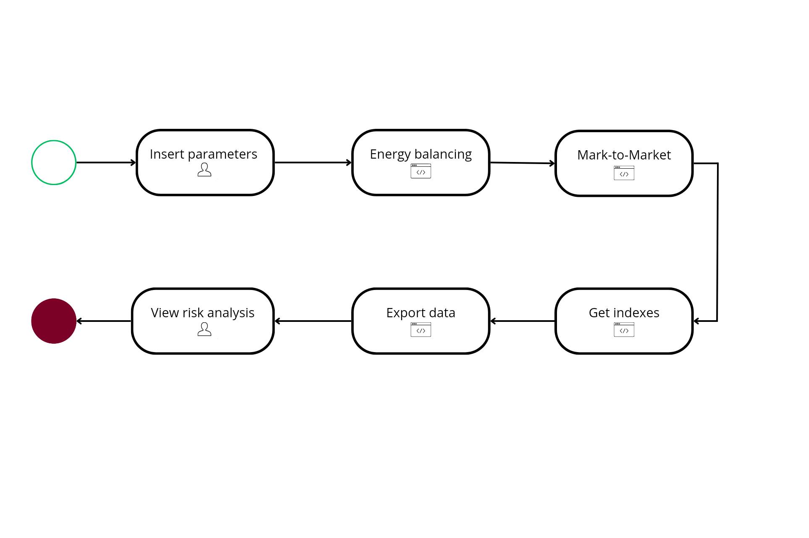

If you want to consult the full paper, please [click here](http://bib.pucminas.br:8080/pergamumweb/vinculos/000092/00009251.pdf).

# Problem Description

Generation, consumption, and commercialization agents belonging to the Free Contracting Environment do not have a prior contract with the State determining the value of the energy consumed and/or generated. Instead, to meet their demand, they need to establish contracts among themselves, freely negotiated between the parties, where prices, terms, volumes, and security clauses are established.

However, the Electric Energy Market is dynamic both in the broad sense (due to, for example, risk factors involving generation – e.g., natural weather conditions – as well as the fluidity present in energy consumption – e.g., economic recession) and in the strict sense (due to risks present in the daily operation of the company to which the agent belongs).

Thus, the contract management of these agents needs parameters to analyze if the portfolio is sufficient to meet short-term demands (e.g., to avoid being burdened by the Brazilian Commercial Company if the estimated hourly cost is costly) and long-term demands (to ensure advantageous and safe negotiations for their company, for example).

# Solution to the Problem

One of the existing tools to support the contract management of these agents is the use of risk indicators present in their respective portfolios. These risks are measured through statistical analyses, performing a normal distribution of the current contracts in the portfolio, which allows for examining their dispersion and consequently, the efficiency of the portfolio.

Moreover, considering the increasing demand for computational use to carry out activities as well as the digitalization of contracts in the electric sector, this repository proposes to build a tool to analyze digital electric energy contracts on a platform integrated with the electric energy market, in this case, SYDLE ONE.

Firstly, it was necessary to computationally model the entities present in the context of managing a portfolio of ACL contracts, such as contracts, the contract portfolio, the forward curve, mark-to-market, as well as risk indicators. Then, it was necessary to organize these entities into a process flow with automated steps, thus creating a kind of risk calculator, where the contract manager would input their portfolio and receive risk indicators as a response. Finally, it is worth noting that to establish the indicators, it was necessary to use a forward curve. Therefore, the results of a projection carried out by BBCE from June 2020 to December 2023 were consulted. In this way, the entire simulation had this period as its time window.


# Data Structures Modeling

Every entity in SYDLE ONE follows the concept of classes present in Object-Oriented Programming (OOP). Therefore, a class is a set of objects that share similar characteristics, which can be a collection of several objects or even just one object. Conceptually, a class can be divided into three parts: its identity, its attributes, and its methods.

Thus, the identity would be the representative name of the class. The attributes would be the structures of the information present in the class; in the case of SYDLE ONE, these would be its fields (each with an identifier and an associated type – text, number, date, boolean, script, etc.). Finally, the methods would be the functionalities or behaviors that the class can execute.

Therefore, all entities related to the contract portfolio were modeled according to the schema below. Note that the Portfolio entity comprises several contracts, which describe their be-like, counterpart, submarket, modulation type, duration period, MWmed values, and the MWh price.


Similarly, a linkage between the classes of the forward curve was created. In this case, an entity was modeled that contains all the information inherent to the curve as you can see below, such as the periodicity of the estimated prices, the type of energy generated, the type of price present in the curve, and its submarket.


Additionally, a method called "import()" was created, responsible for reading the file containing the curve data and creating a projection (class Projection of the forward curve), linking an object to each value present in the curve (class Data of the forward curve).

For the risk indicators, a class titled Risk Indicator was modeled, which has a name, a description, and a script for calculating the index. Thus, each indicator proposed in the work (VaR, CVaR, Expected Value, and Prob. value < 0) was instantiated with a specific script for its calculation.


For the mark-to-market data, an entity called Mark-to-Market Data was created, which has as attributes the portfolio (and all the relationships involved), the period of that projection, and the marking in Brazilian Real (R$).

# Modeling Analysis Techniques

To establish the indices in a portfolio for a type of agent, a process was modeled using BPMN notation. The process is initiated by someone responsible for the company's middle office, represented in this work by the contract manager.




## Process Start

The process begins with the contract manager specifying which portfolio will be calculated. If the manager is of the consumer or generator type, they indicate the minimum and maximum values (of generation or consumption) and the volatility to be used for the projection.


From this stage, a sequence of scripts begins, which will be explained and represented by the algorithm below.

## Perform Energy Balancing

This algorithm aims to balance the energy of the manager's contract portfolio. Thus, the algorithm takes as input the type of agent and their portfolio, and as output, it provides the energy balance for their context.

```jsx

Input: wallet, agencyType, load, generation
Output : energyBalancing
begin
var hit ← fecth(aggsMinDateMaxDate(wallet));
var minDate ← hit.dataMin
var maxDate ← hit.dataMax
var timeline ← createTimeline(minDate, maxDate)
if agencyType == consumer
   var loadForecast ← createLoadForecast(load, timeline)
   return energyBalancing ← createEnergyBalancing(loadForecast, wallet, timeline)
else if agencyType == generator
   var genForecast ← createGenForecast(generation, timeline)
   return energyBalancing ← createEnergyBalancing(genForecast, wallet, timeline)
else if agencyType == commercial
   return energyBalancing ← createEnergyBalancing(wallet, timeline)
end
```

## Mark-to-Market (MtM)

In this stage, with the energy balance already performed, the algorithm receives the balance and the type of forward curve to be used for marking as inputs. The system retrieves the curve data, and for each month of the balance, a projection of the balance's value in Brazilian reais is generated.

```jsx
Input: energyBalancing, wallet, forwardCurveType
Output: mtm
begin
var hit ← fetch(forwardCurve(forwardCurveType))
var forwardCurveData
forwardCurveData ← hit.forwardCurveData
var mtm ← createMtM(wallet, eneegyBalancing, forwardCurveData)
return mtm
```

## Perform Risk Analyses with Modeled Indices

This process stage aims to calculate the modeled indices of a portfolio. The mark-to-market values are linked to the portfolio. Thus, by specifying the portfolio as a parameter, a search is conducted for each index, responsible for retrieving the marking associated with the portfolio and performing statistical analyses, returning the associated numerical value.

## Export Data

This stage is responsible for aggregating all the information generated in the analysis into a ".csv" file, which is made available to the portfolio manager at the end of the process.

## Process End

Finally, after going through all the previous calculation stages, the portfolio manager receives all the necessary information to perform a risk analysis of their portfolio based on the modeled parameters.


